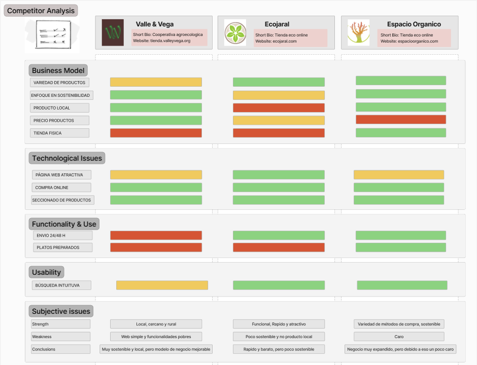

## DIU - Practica1, entregables

- Desk research: Análisis Competencia
  
  >>> Nos hemos decantado por Espacio Organico, nos ha parecido la pagina mas completa, la que mejor sensaciones nos dió usandola y por algunos detalles de uso por ejemplo de productos populares en el buscador, que se te muestre un mensaje al añadir al carrito, mayor rapidez y opciones de envío.
  >>> Por tanto pensamos que EspacioOrganico es la opción que más nos puede ayudar a mejorar nuestra pagina y a hacerla mas completa y con el menor numero de fallos.
  
- 2 Personas

  
  >>> Hemos elegido a Francisco para poner ejemplo de personas deportistas, ya sea futbol o cualquier otro deporte, ya que la gente profesional cuida mucho su dieta para seguir en la élite del deporte.
  >> Por ello intentamos con el ejemplo de esta persona, llegar a que mas deportistas que quieren subir su nivel se sientan identificados y basen su dieta en productos de calidad, y no en los típicos procesados de algunos supermercados que "dicen" tener proteina por ejemplo y luego estan llenos de procesados.

  
  >>> A Pedro lo hemos elegido porque muestra como el conocimiento y consumo de los productos naturales tiene beneficios, y que son mucho mas sanos que los procesados.
  >>> Por esa razon el prepara siempre la comida de su padre con productos naturales y artesanos, se puede ver al ser una persona criada en el campo su gran habilidad para desenvolverse en estos ambitos, tambien las muchas responsabilidades que tiene a su temprana edad han sido un punto a tener en cuenta para su elección.
  
- 2 User Journey Map  ( 1 por persona)
  >>> Escenario: La situacion de Francisco no es muy comun en general pero si más comun en el mundo del futbol, le comunicaron que tenía que hacer una dieta para subir de peso y aumentar su masa muscular de calidad, por ello, Fran decide informarse en la compra online ya que es mucho mas comodo y ademas con productos locales y no tan procesados como los de las grandes cadenas de supermercados.
>>>Tuvo varios problemas con la pagina que encontró, y no quedo muy satisfecho con su experiencia, debido a problemas como acciones con respuestas lentas, falta de estructuración en la página, entrega algo tardía para sus espectativas y sin posibilidad de envío express.
  

>>> Escenario: El escenario que sufre Pedro es mas común de lo que nos creemos, España es un país con muchísimo ámbito rural lo que implica que mucha gente vive en el campo, muchas veces alejada de incluso otras fincas o casas. Por eso nos ha parecido interesante cubrir este escenario que en el tema de los mercados sostenibles le puede ocurrir a mucha más gente de la que nos imaginamos.
>>> Estos casos también hay que tenerlos en cuenta y poner varias opciones de envio, contactar con el cliente si al momento de repartir no se ubica bien, ademas de que el cliente pueda disponer de acciones como buscar puntos de recogida cercanos, o dar detalles sobre la dirección.
  
  
- Revisión de Usabilidad
  

>>>> Como valoración final de esta practica podemos decir que nos ha hecho pensar y recordar la gran cantidad de buenos productos que tenemos cerca, pero simplemente no tienen visibilidad, también la diferencia de los productos por ejemplo un producto cuidado en el campo de manera natural, a un producto criado en invernaderos y con cantidades de conservantes con el objetivo de vender.
>>>> En esta practica hemos encontrado páginas únicas que solucionan estos problemas, cada una a su forma y con sus ideas. 
