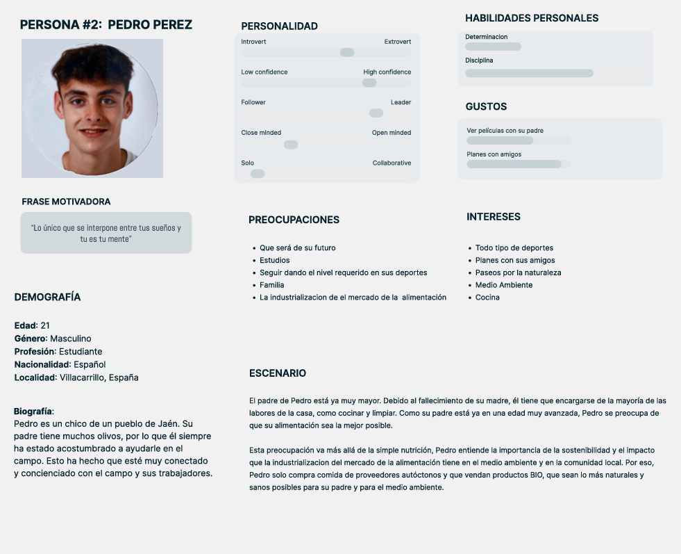

## DIU - Practica1, entregables

- Desk research: Análisis Competencia
  
- 2 Personas
  
  
  
  
- 2 User Journey Map  ( 1 por persona)
  
  
  
- Revisión de Usabilidad
  

>>>> Como valoración final de esta practica podemos decir que nos ha hecho pensar y recordar la gran cantidad de buenos productos que tenemos cerca, pero simplemente no tienen visibilidad, también la diferencia de los productos por ejemplo un producto cuidado en el campo de manera natural, a un producto criado en invernaderos y con cantidades de conservantes con el objetivo de vender.
>>>> En esta practica hemos encontrado páginas únicas que solucionan estos problemas, cada una a su forma y con sus ideas. 
