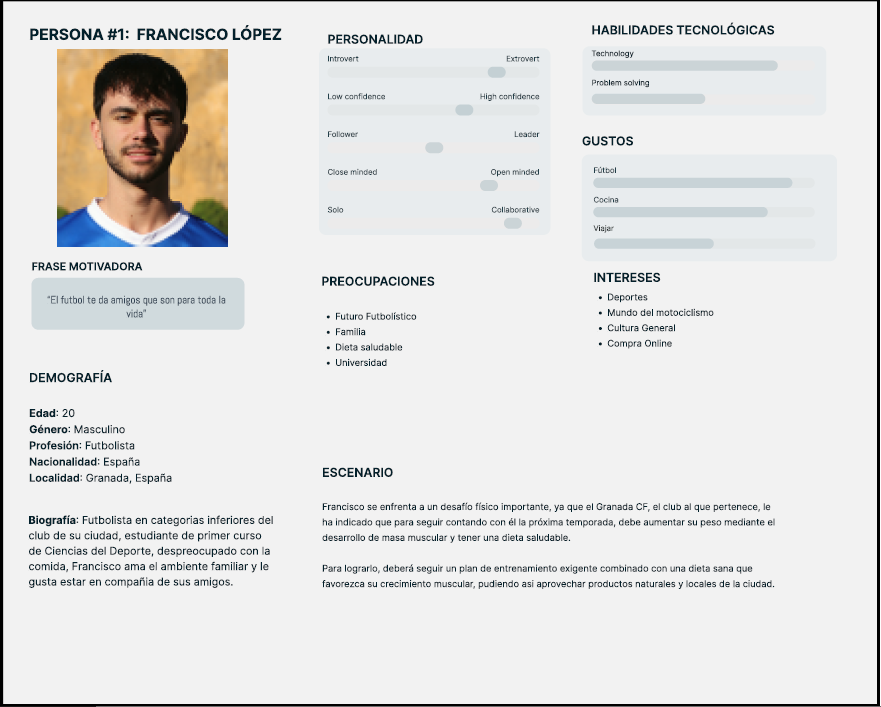

## DIU - Practica1, entregables

### 1.a User Reseach Plan
Los mercados ecológicos en Granada como el EcoMercado de Granada y la asociación Valle y Vega, son dos iniciativas conocidas en el fomento del consumo sostenible y local. A través de estos espacios, los clientes adquieren productos orgánicos de manera directa, favoreciendo así a la economía local y produciendo un menor impacto ambiental, considerando el transporte y la producción rápida industrial.

El presente estudio abordará el ecosistema de los mencionados mercados, centrándose en los hábitos, las necesidades y las expectativas de sus integrantes-base: los clientes, los propietarios de los puestos y los organizadores. El estudio se enfocará en la motivación detrás de la elección de los usuarios, las barreras de acceso y las oportunidades de mejora.

La estrategia de investigación incluirá tanto métodos cualitativos como cuantitativos: Entrevistas con compradores y vendedores, observaciones en los mercados y encuestas para analizar patrones de consumo de los compradores. Además, se estudiará el impacto de la digitalización en la comercialización de productos ecológicos.

El objetivo final es encontrar puntos clave que permitan mejorar la experiencia de los usuarios y potenciar el crecimiento de estos mercados ecológicos en Granada.

### 1.b Competitive Analysis
VERDE -> bueno      
AMARILLO -> regular      
ROJO -> malo

  
  >>> Nos hemos decantado por Espacio Organico, nos ha parecido la pagina mas completa, la que mejor sensaciones nos dió usandola y por algunos detalles de uso por ejemplo de productos populares en el buscador, que se te muestre un mensaje al añadir al carrito, mayor rapidez y opciones de envío.
  >>> Por tanto pensamos que EspacioOrganico es la opción que más nos puede ayudar a mejorar nuestra pagina y a hacerla mas completa y con el menor numero de fallos.
  
### 1.c Personas
  >>> Hemos elegido a Francisco para poner ejemplo de personas deportistas, ya sea futbol o cualquier otro deporte, ya que la gente profesional cuida mucho su dieta para seguir en la élite del deporte.
  >> Por ello intentamos con el ejemplo de esta persona, llegar a que mas deportistas que quieren subir su nivel se sientan identificados y basen su dieta en productos de calidad, y no en los típicos procesados de algunos supermercados que "dicen" tener proteina por ejemplo y luego estan llenos de procesados.
  
  
  >>> A Pedro lo hemos elegido porque muestra como el conocimiento y consumo de los productos naturales tiene beneficios, y que son mucho mas sanos que los procesados.
    >>> Por esa razon el prepara siempre la comida de su padre con productos naturales y artesanos, se puede ver al ser una persona criada en el campo su gran habilidad para desenvolverse en   estos ambitos, tambien las muchas responsabilidades que tiene a su temprana edad han sido un punto a tener en cuenta para su elección.
  
  
  
### 1.d User Journey Map
  >>> Escenario: La situacion de Francisco no es muy comun en general pero si más comun en el mundo del futbol, le comunicaron que tenía que hacer una dieta para subir de peso y aumentar su masa muscular de calidad, por ello, Fran decide informarse en la compra online ya que es mucho mas comodo y ademas con productos locales y no tan procesados como los de las grandes cadenas de supermercados.
>>> Tuvo varios problemas con la pagina que encontró, y no quedo muy satisfecho con su experiencia, debido a problemas como acciones con respuestas lentas, falta de estructuración en la página, entrega algo tardía para sus espectativas y sin posibilidad de envío express.

  

>>> Escenario: El escenario que sufre Pedro es mas común de lo que nos creemos, España es un país con muchísimo ámbito rural lo que implica que mucha gente vive en el campo, muchas veces alejada de incluso otras fincas o casas. Por eso nos ha parecido interesante cubrir este escenario que en el tema de los mercados sostenibles le puede ocurrir a mucha más gente de la que nos imaginamos.
>>> Estos casos también hay que tenerlos en cuenta y poner varias opciones de envio, contactar con el cliente si al momento de repartir no se ubica bien, ademas de que el cliente pueda disponer de acciones como buscar puntos de recogida cercanos, o dar detalles sobre la dirección.

  
  
### 1.e Usability Review

>>>  El objetivo es revisar la usabilidad del competidor seleccionado. Usamos un checklist de verificación. Tras usarlo, subelo a la carpeta P1/ Ofrece aquí un parrafo para:
>>> - Enlace al documento:   
>>> - URL y Valoración numérica obtenida:
>>>   - URL: espacioorganico.com
>>>   - Valoracion: 78 (Good)   
>>> - Comentario sobre la revisión:
>>>   - En los puntos fuertes hemos visto que la pagina tiene una gran variedad de productos y se ve muy atractica, pero flaquea sobretodo en la explicacion de errores y en el lenguaje que ultiliza, el cual a veces puede no ser el adecuado para gente que no esta acostumbrada a este tipo de paginas.
