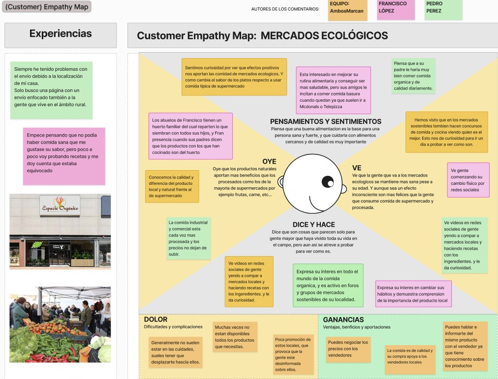

## DIU - Practica2, entregables

### Ideación 
Debemos idear una propuesta de mercado online para impulsar la sostenibilidad y el producto local y ecologico en Granada. Para ello, se diseñará una supuesta aplicación de forma que se cubran las necesidades de los potenciales usuarios, Logic-Ecologic.

* Malla receptora de información
  

* Mapa de empatía

* Resumen de la ideación

### PROPUESTA DE VALOR
Con **Logic-Ecologic** descubrirás una nueva forma de conectar con los mercados sostenibles y el producto local de Granada. Apoya a productores responsables, accede a alimentos frescos y de temporada, y contribuye activamente a un modelo de consumo más consciente, saludable y ecológico. Todo desde una plataforma digital pensada para quienes quieren marcar la diferencia en su forma de consumir.  
**Únete a Logic-Ecologic y forma parte del cambio hacia un futuro más sostenible.**

* ScopeCanvas

### TASK ANALYSIS

* User Task Matrix 
* User/Task flow

### ARQUITECTURA DE INFORMACIÓN

* Sitemap 
* Labelling 

### Prototipo Lo-FI Wireframe 

### Conclusiones  
(incluye valoración de esta etapa)

>>>> Este fichero se debe editar para que cada evidencia quede enlazada con el recurso subido a la carpeta de la practica. Se pide más detalle técnico en las descripciones de lo que sería el README principal del repositorio y que corresponde a la descripcion del Case Study.
>>>> Termine con la seccion de Conclusiones para aportar una valoración final del equipo sobre la propia realización de la práctica
