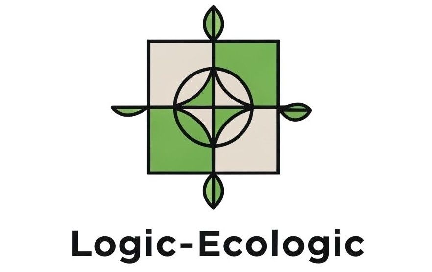

## DIU - Practica2, entregables

### Ideación 
Debemos idear una propuesta de mercado online para impulsar la sostenibilidad y el producto local y ecologico en Granada. Para ello, se diseñará una supuesta aplicación de forma que se cubran las necesidades de los potenciales usuarios, Logic-Ecologic.

* Malla receptora de información
  - Con nuestro 'Capture Grid' lo que buscamos es recopilar, organizar y sintetizar de manera estructurada las observaciones, ideas y comentarios de nuestro proyecto. Para esto hemos usado las opiniones de Pedro y Fransico en cuanto a que nos digan algunas cosas interesantes, algunas criticas y algunas preguntas que tengan. Finalmente hemos aportado nosotros algunos aspectos nuevos que hemos decidido incorporar en nuestra pagina.
  

* Mapa de empatía

### PROPUESTA DE VALOR
Con **Logic-Ecologic** descubrirás una nueva forma de conectar con los mercados sostenibles y el producto local de Granada. Apoya a productores responsables, accede a alimentos frescos y de temporada, y contribuye activamente a un modelo de consumo más consciente, saludable y ecológico. Todo desde una plataforma digital pensada para quienes quieren marcar la diferencia en su forma de consumir.  
**Únete a Logic-Ecologic y forma parte del cambio hacia un futuro más sostenible.**

* ScopeCanvas

En los users needs, hemos reflejado los principales matices que los usuarios valoran a la hora de utilizar una aplicación. Además, éstos podrán realizar distintas acciones como dejar valoraciones, compartir su carrito y otras opciones similares.  
Mediremos el éxito de la aplicación mediante los informes ofrecidos por los proveedores de productos (por ejemplo: aumento de la venta de su comercio en base a nosotros), feedback de los usuarios, ingresos y numero de usuarios registrados.

### TASK ANALYSIS

* User Task Matrix

**VALORACION:**  
0 -> Nunca/ muy poca frecuencia  
1 -> Poca frecuencia  
2 -> Frecuencia medio-alta  
3 -> Mucha frecuencia  

* User/Task flow
  
  Hemos realizado el Task Flow de una de las funcionalidades clave de una pagina de venta de productos como es la nuestra.
  Esta funcionalidad es la de **realizar una compra**, donde hemos puesto todos los pasos que deberia realizar un cliente a la hora de hacer un pedido en nuestra pagina.
  
  

### ARQUITECTURA DE INFORMACIÓN

* Sitemap

  
* Labelling

| Etiqueta                     | Descripción                                                                                                                       |
|-----------------------------|------------------------------------------------------------------------------------------------------------------------------------|
| Buscar producto             | Permite localizar productos disponibles desde el buscador principal.                                                               |
| Iniciar sesión              | Acceso para usuarios registrados o premium.                                                                                        |
| Buscar artículos eco        | Listado de contenidos informativos relacionados con comida ecológica.                                                              |
| Ver FAQ                     | Sección de ayuda con respuestas a preguntas frecuentes.                                                                            |
| Filtrar búsqueda            | Opción de aplicar filtros para afinar los resultados del buscador.                                                                 |
| Comprar                     | Realizar la compra de productos seleccionados.                                                                                     |
| Calificar producto          | Valorar un producto con estrellas o comentarios.                                                                                   |
| Contactar                   | Formulario o medios para contactar con el equipo de Logic Ecologic.                                                                |
| Compra habitual             | Consulta de productos que el usuario suele comprar recurrentemente.                                                                |
| Reseñar producto            | Añadir una reseña textual sobre un producto adquirido.                                                                             |
| Ver procedencia             | Información sobre el origen del producto (productor, ingredientes, etc.).                                                          |
| Plan premium                | Página para contratar el plan premium con sus ventajas.                                                                            |
| Ofertas                     | Acceso a promociones y descuentos exclusivos.                                                                                      |
| Buscar ayuda                | Acceso al centro de ayuda o guía de uso.                                                                                           |
| Recuperar contraseña        | Función para restaurar acceso en caso de olvido de contraseña.                                                                     |
| Reiniciar compra habitual   | Permite vaciar y configurar de nuevo su selección de productos frecuentes.                                                         |
| Registrarse                 | Creación de cuenta nueva en la plataforma.                                                                                         |
| Productos populares         | Consulta de productos destacados o más valorados.                                                                                  |
| Cookies                     | Información y configuración de cookies.                                                                                            |
| Newsletter                  | Gestionar la suscripción a comunicaciones por correo.                                                                              |
| Cambiar contraseña          | Modificar la clave de acceso desde el perfil de usuario.                                                                           |
| Cerrar sesión               | Finaliza la sesión del usuario activo.                                                                                             |

### Prototipo Lo-FI Wireframe 
La herramienta que hemos usado ha sido Notewise.

### Conclusiones  
En esta fase hemos definido los pilares de nuestra aplicación Logic-Ecologic, centrada en promover el consumo responsable y local en Granada. A través de herramientas como el mapa de empatía, el ScopeCanvas y el análisis de tareas, hemos identificado las funcionalidades clave y cómo se usarán según el tipo de usuario.

El diseño del sitemap, el etiquetado y el prototipo Lo-Fi nos han permitido estructurar mejor la información y visualizar la futura experiencia de uso. Esta etapa nos deja una base sólida para continuar con el diseño centrado en el usuario y validar nuestras decisiones en siguientes iteraciones.
