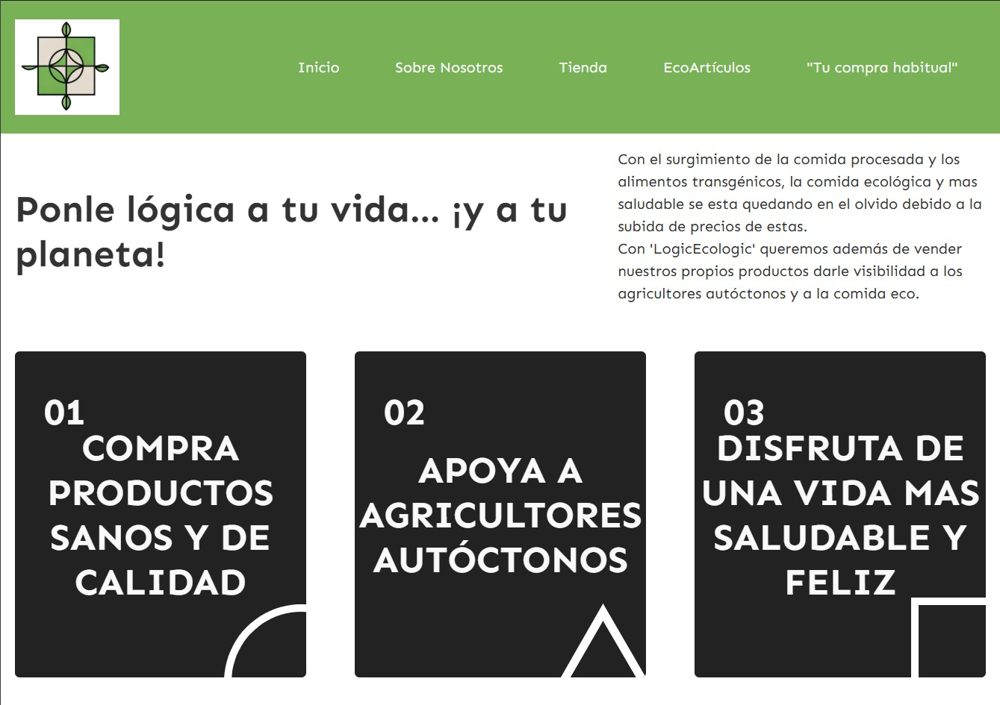

# DIU - Practica 3, entregables

### Moodboard (diseño visual + logotipo)
  - Con el moodboard, lo que buscamos es evocar nuestros sentimientos sobre nuestra página a través de una colección de imágenes, muestras de color, texto y fuentes. Así, tanto nosotros mismos como el cliente podemos tener más claro qué buscamos con nuestra página.

  
    
### Landing Page
  - El Landing Page es la primera toma de contacto del usuario con nuestra plataforma, por lo que debemos hacerla lo más atractiva posible para llamar y retener su atención y convencerlo de descargarsela. Queremos captar al usuario con nuestro eslogan para que siga en la plataforma, y conozca la funcionalidades que ofrecemos, haciendo uso de los componentes definidos en el Moodboard.

  - [Puedes visitar la landing page en este enlace](http://logicecologic-824774.webflow.io/). Utilizamos la herramienta [Webflow](www.webflow.io) para crearla.

### GuideLines
Los patrones de diseño que hemos decidido utilizar en el diseño de nuestra aplicación son los siguientes:
  - Onboarding: Esta será la página principal que los usuarios verán al entrar en nuestra página. En ella buscaremos que el usuario se sienta cómodo con nuestra página e incitarlo a que se quede.
  - Menú (adaptado a móvil): Es la página que aparecerá tras el onboarding y que mostrará al usuario todo lo necesario para empezar a realizar su compra.
  - Carrusel: Un carrusel con los productos destacados del día que pueden interesarle al usuario, con productos que ya compró anteriormente o con los que están en oferta. Estos diferentes carruseles pueden ir en distintas páginas.
  - Search: Una barra de búsqueda para que el usuario pueda buscar los productos que desee.
  - Card Items: Para representar distintos productos de la página.
  - Item Details: Los productos contendrán el nombre del producto, su precio, ingredientes, alérgenos e información nutricional.
  - Reserva: En el caso de nuestra página, será la acción de guardar un producto en nuestro carrito de la compra.
  - Form Input: Para nuestro form input hemos pensado en poner un slider que represente los kilómetros; estos representarán la distancia a la que el usuario está dispuesto a que procedan sus productos.
  - About: Una pequeña descripción de quiénes somos, qué hacemos, cuál es nuestra idea y cuál es nuestro fin último.
   
### Mockup: LAYOUT HI-FI
[Mockup accesible]([http://logicecologic-824774.webflow.io/](https://www.figma.com/design/LIJcYPqpDTh2SzlqtOg3wd/Layout-Hi-Fi--Copy-?node-id=0-1&p=f&t=imJqoZQwvP186xRv-0)).

### Publicación del Case Study

## Conclusiones

>>>> Este fichero se debe editar para que cada evidencia quede enlazada con el recurso subido a la carpeta de la practica. Se pide más detalle técnico en las descripciones de lo que sería el README principal del repositorio y que corresponde a la descripcion del Case Study.
>>>> Termine con la seccion de Conclusiones para aportar una valoración final del equipo sobre la propia realización de la práctica
