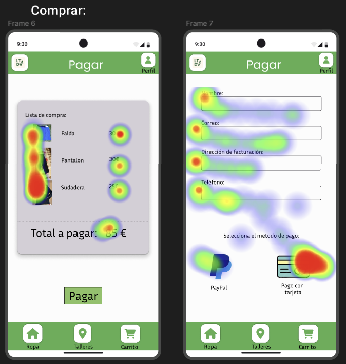

# DIU - Practica 4, entregables

## Asignación del caso B
Se nos ha asignado el grupo **DIU3.LEVELING**. Link del GitHub: https://github.com/DIU3-LEVELING/UX_CaseStudy

### 4.a Reclutamiento de usuarios 

Nuestra misión era evaluar la usabilidad de la plataforma [La Tela De Vida](https://github.com/DIU3-LEVELING/UX_CaseStudy), que se enfoca en promover la moda circular, ofreciendo una plataforma confiable donde las personas puedan comprar ropa usada de calidad y tener la opcion de darle un toque personal en talleres.

Uno de los desafíos que enfrentamos fue entender cómo los diferentes usuarios interactúan con las distintas funcionalidades de la plataforma. Desde la navegación por las diferentes prendas,  la participación en talleres, necesitábamos una visión clara de la experiencia del usuario.

Para abordar esto, seleccionamos un grupo diverso de usuarios que realizarían tareas específicas en la plataforma, y luego evaluaríamos su experiencia utilizando métodos de testing de usabilidad y el cuestionario SUS.

| Usuarios | Sexo/Edad     | Ocupación   |  Exp.TIC    | Personalidad | Plataforma | Caso
| ---------| ------------- | ----------- | ----------- | -----------  | ---------- | ----
| Eduardo  | H / 72        | Jubilado    | Baja/Media  | Extrovertido | Móvil      | A 
| Felipe   | H / 26        | Informatico | Alta        | Introvertido | Linux      | A 
| Julian   | H / 21        | Estudiante  | Alta        | Timido       | Windows    | B 
| Manuela  | M / 42      | Directora financiera  | Media | Emocional | Móvil     | B

**Historia de los Usuarios**

Eduardo, un jubilado de 72 años, con poca experiencia en tecnología, utiliza su movil para explorar la plataforma. Persona extrovertida, que se interesa por los articulos ofrecidos y los valora como una oportunidad para aprender.

Felipe, informático de 37 años, es introvertido y tiene un conocimiento alto en tecnología. Accede desde su portatil con Linux a la plataforma, disfrutando de la facilidad de comprar desde casa y leer EcoArticulos para inspirarse a llenar el carrito.

Julian, un estudiante tímido de 21 años con alta experiencia en tecnología, utiliza Windows para acceder a la plataforma. Aunque reservado, valora la estructura clara y la facilidad de acceso a información sobre los productos.

Manuela, directora financiera racional de 42 años, utiliza su móvil para acceder a la plataforma. Aprecia la organización lógica , la claridad en la presentación y precios a la vista.

### 4.b Diseño de las pruebas 

Para hacer las pruebas de usabilidad y diversas características de ambas paginas hemos usado las sigueintes pruebas:

   - 1⁰. Hemos cogido 4 personas con perfiles los cuales encajan con las respectivas páginas, para que la valoración sea lo mas equilibrada posible.
   - Con estas personas hemos procedido a hacer el cuestionario SUS, donde basandonos en algunas preguntas ya predefinidas los usuarios valoraran su experiencia en la página. Con estas preguntas sacaremos una valoracion de ambas páginas para comprarlas.
   - Para el A/B Testing hemos diseñado 5 pruebas con las cuales sacaremos una tabla y un resultado agregado global. Las pruebas son las siguientes:
      - 1ra prueba, "Facilidad de añadir al carrito"
      - 2da prueba, 2. Claridad y Detalle de los Productos, Descripciones ricas, bien estructuradas, con información clave del producto destacada y accesible.
      - 3ra prueba, 3. Detalle de las Reseñas, Sección de reseñas completa con filtros de utilidad, la posibilidad de añadir comentario como valoración.
      - 4ta prueba, Facilidad en el Proceso de Pago.
      - 5ta prueba, Visibilidad de Productos Populares, Sección de "Productos Populares" destacada, intuitiva y actualizada regularmente en la página principal.

Una vez hecha la valoración, procedemos a hacer el resultado agregado global. 

Por ultimo, hemos hecho el test de Eye Tracking para hacer en las paginas un mapa de calor, donde podemos ver donde mas miran los clientes cuando esta  usando nuestra página.

### 4.c Cuestionario SUS

Para realizar un análisis de ambas aplicaciones, usaremos un cuestionario SUS. Para ello veremos la calificacion de las personas ficticias que hemos descrito anteriormente.

Los resultados obtenidos se encuentran en [el siguiente fichero](Cuestionario_SUS_DIU.xlsx).

Podemos ver que ambas paginas han obtenido buenos resultados en el cuestionario SUS. Siendo Tela de Vida un poco superior en resultados.

Los resultados han quedado de la siguiente forma:    
- LogicEcologic: Eduardo -> 72.5 puntos | Felipe -> 82.5
   - Total normalizado: 77.5
- Tela de Vida: Manuela -> 82.5 | Julián -> 80
   - Total normalizado: 81.25

### 4.d A/B Testing

Los resultados de un A/B testing con 5 pruebas y 2 casos o alternativas darían como resultado una tabla de 5 filas y 2 columnas, además de un resultado agregado global. A continuación, se especifica con claridad el resultado: ¿qué caso es más usable, A o B?

Para el A/B testing, hemos diseñado cinco pruebas clave para comparar la usabilidad de tu plataforma **LogicEcologic (Caso A)** y la plataforma **La Tela De Vida (Caso B)**, centrándonos en el proceso de compra y la interacción con los contenidos. Los resultados se resumen en la siguiente tabla, junto con una valoración global:

| Prueba | Caso A (LogicEcologic) | Caso B (La Tela De Vida) |
|---|---|---|
| **1. Facilidad de Añadir al Carrito (tiempo esperado=7s)** | Tiempo medio: 5 segundos. 2% de errores de navegación. Valoración 8/10 | Tiempo medio: 5 segundos. 2% de errores de navegación. Valoración 8/10 |
| **2. Claridad y Detalle de los Productos** | **Descripciones ricas, bien estructuradas, con información clave del producto destacada y accesible.** Tiempo medio de comprensión: 8 segundos. Errores de interpretación: 2%. Valoración 8.5/10| Descripciones funcionales, pero con información clave a veces menos visible, requiriendo más lectura. Tiempo medio de comprensión: 12 segundos. Errores de interpretación: 7%. Valoración 6/10 |
| **3. Detalle de las Reseñas** | **Sección de reseñas completa con filtros de utilidad, la posibilidad de añadir comentario como valoración.** 90% de usuarios las encuentran útiles. Valoracion 9/10| Reseñas básicas, a veces sin filtros, unica opción de valoracion y menor visibilidad de respuestas del vendedor. 60% de usuarios las encuentran útiles. Valoracion 6.5/10|
| **4. Facilidad en el Proceso de Pago** | Proceso lineal y seguro, pero el mayopr abandono es por gente que no esta registrada y para realizar el pedido hay que estar registrado. Valoración 7.5/10. 8% de usuarios abandonan la simulación. | **Proceso optimizado, con detalle en los pasos, indicadores de progreso claros y feedback.** Valoración: 9/10. 3% de usuarios abandonan la simulación. |
| **5. Visibilidad de Productos Populares** | **Sección de "Productos Populares" destacada, intuitiva y actualizada regularmente en la página principal.** Tasa de clic en esta sección: 15%. Valoración: 9/10 | Sección de productos destacados menos prominente o actualizada esporádicamente. Tasa de clic en esta sección: 8%. Valorción del 6/10 |

**Resultado Agregado Global:**

Tras analizar los resultados de las cinco pruebas, **el Caso A (LogicEcologic) es, en general, más usable con 84% ** que el Caso B (La Tela De Vida) con 71%.

* En la **facilidad de añadir al carrito**, ambas plataformas muestran un rendimiento **empatado**, logrando que los usuarios añadan productos de forma rápida y eficiente.
* Sin embargo, en la **claridad y detalle de los productos**, **LogicEcologic (Caso A) demuestra una superioridad clara**. Sus descripciones son más ricas y estructuradas, permitiendo a los usuarios **identificar rápidamente información crucial como la procedencia o los ingredientes** con menos errores de interpretación.
* En el **detalle de las reseñas**, **LogicEcologic (Caso A) también sobresale**. La riqueza de información en las reseñas, con las opciones valoracion y reseña, aumenta significativamente la confianza y la utilidad percibida por los usuarios.
* Respecto a la **facilidad en el proceso de pago**, **La Tela De Vida (Caso B) es la que ofrece una experiencia ligeramente superior**. Su proceso optimizado y detallado, se traduce en una mayor satisfacción del usuario y una menor tasa de abandono.
* Finalmente, en la **visibilidad de productos populares**, **LogicEcologic (Caso A) presenta una ventaja significativa**. Su sección "Productos populares" y bien gestionada impulsa una mayor interacción de los usuarios con estos productos.

Estos resultados sugieren que, aunque La Tela De Vida tiene un proceso de pago muy eficiente, el diseño y la estructura general de **LogicEcologic** ofrecen una experiencia de usuario superior en los aspectos clave de búsqueda de información, confianza a través de reseñas y descubrimiento de productos.

### 4.e Aplicación del método Eye Tracking 

Este estudio de Eyetracking lo hemos llevado a cabo para analizar el comportamiento visual de los usuarios mientras realizan dos tareas diferentes en dos plataformas distintas.
Los usuarios escogidos son Carmen y Jaime.
- Carmen hará la tarea A.
- Jaime hará la tarea B.

Para realizar el eyetracking hemos usado un plugin de Figma (NB Heatmap).

Las tareas que deberan realizar los usuarios escogidos seran las siguientes:
1. Tarea A: Realizar un pago completo

2. Tarea B: Consultar uno de los articulos que hay publicados en la seccion de Ropa.
- En esta tarea comentar la necesidad de incluir una parte exclisivamente dedicada a la talla para que se vea rapidamente y obligatoriamente.

Los objetivos de este estudio son:
* Identificar áreas de interés (AOI) en las interfaces de usuario.
* Analizar patrones de fijación y movimientos oculares.
* Evaluar la usabilidad de las plataformas en función del comportamiento visual de los usuarios.

### 4.f Usability Report de B

**Valoración General:**

La Tela De Vida es una plataforma visualmente atractiva y funcional, pero identificamos áreas clave para mejorar la experiencia del usuario.

**Debilidades de Usabilidad y Recomendaciones:**

Falta de confirmación visual (Visibilidad del Estado del Sistema):

Problema: Al añadir artículos o registrarse, no siempre hay una confirmación clara de que la acción se ha realizado.
Recomendación: Implementar notificaciones visuales (pop-ups, cambios de iconos) para confirmar cada acción del usuario.
Dificultad para retroceder (Control y Libertad del Usuario):

Problema: En procesos largos (inscripción a talleres, subida de prendas), los botones para volver atrás o cancelar no siempre son fáciles de encontrar.
Recomendación: Asegurar que los botones de "volver" o "cancelar" sean siempre visibles y accesibles en cada paso de un proceso.
Inconsistencia en el diseño (Consistencia y Estándares):

Problema: Pequeñas variaciones en tipografías y estilos de botones en diferentes secciones de la plataforma.
Recomendación: Estandarizar el diseño de todos los elementos (textos, botones) para una apariencia más pulcra y coherente.
Información de producto poco destacada (Reconocimiento antes que Recuerdo):

Problema: Tallas o el estado de la prenda no siempre son visibles en el listado, obligando al usuario a buscar en la descripción.
Recomendación: Destacar visualmente la información clave (talla, estado, precio) directamente en los listados de productos.
Ayuda limitada (Ayuda y Documentación):

Problema: La sección de Preguntas Frecuentes (FAQ) no cubre todas las dudas sobre la calidad de las prendas o el funcionamiento detallado de los talleres.
Recomendación: Ampliar la sección de FAQ con respuestas más detalladas y considerar tutoriales cortos para los procesos clave.
Valoración Personal del Equipo LogicEcologic:

Esta evaluación ha sido fundamental para nosotros, LogicEcologic. Nos permitió aplicar nuestros conocimientos de UX en un caso práctico, identificando oportunidades de mejora en la plataforma de nuestros compañeros. Fue una experiencia enriquecedora que profundizó nuestra comprensión de la usabilidad y la importancia de la evaluación constante.
