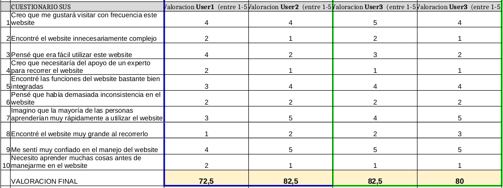
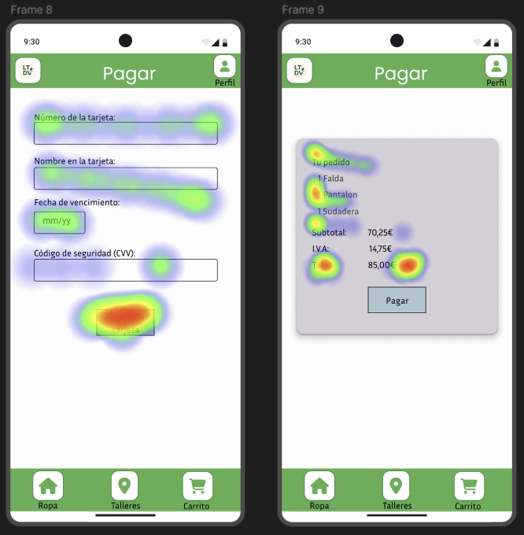
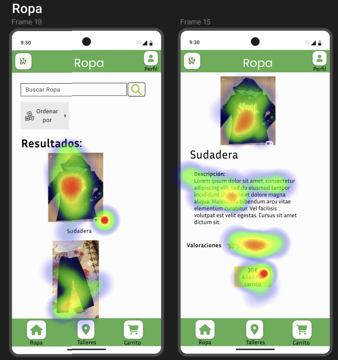

# DIU - Practica 4, entregables

## Asignación del caso B
Se nos ha asignado el grupo **DIU3.LEVELING**. Link del GitHub: https://github.com/DIU3-LEVELING/UX_CaseStudy

## A/B Testing

Vamos a aplicar la metodología de experimentación A/B testing para comparar dos plataformas y saber cuál produce mejores resultados. En este caso vamos a comparar nuestra aplicación (sujeto A) con la del grupo seleccionado (sujeto B).
Este estudio nos será útil como herramienta para la optimización de la conversión y mejora de la experiencia de usuario en nuestra plataforma.

Vamos a llevar a cabo varios pasos:

  - 1º Seleccionamos a varias personas que actuarán como usuarios para las pruebas que vamos a realizar.
  
  - 2º Cada usuario realizará un test SUS; es decir, un cuestionario de varias preguntas sobre la aplicación que previamente habrá probado, y pondrá una puntuación a cada pregunta de 1-5.
  
  - 3º Con la puntuación total de los cuestionarios haremos una puntuación del 0-100, y según el rango que esté tendrá una valoración final.
  
  - 4º Mientras se realiza los tests SUS, vamos a escoger a dos usuarios para realizarles una prueba de Eye Tracking para localizar áreas de interés y zonas que deben mejorar la captación de atención.

## Usuarios:

Los usuarios elegidos han sido creados mediante la combinación de características de Role Play y usuarios de nuestro entorno.

| Usuarios | Sexo/Edad     | Ocupación   |  Exp.TIC    | Personalidad | Plataforma | TestA/B
| ------------- | -------- | ----------- | ----------- | -----------  | ---------- | ----
| Eduardo  | H / 72   | Viudo/Jubilado  | Baja/Media       | Extrovertido | Móvil       | A 
| Felipe  | H / 26   | Informatico  | Alta       | Introvertido       | Linux        | A 
| Julian  | H / 21   | Estudiante     | Alta        | Timido    | Windows      | B 
| Manuela  | M / 42   | Directora financiera  | Media      | Emocional     | Móvil        | B

## Resultados de SUS:

Para realizar un análisis de ambas aplicaciones, usaremos un cuestionario SUS. Para ello veremos la calificacion de las personas ficticias que hemos descrito anteriormente.

Los resultados obtenidos se encuentran en [el siguiente fichero](Cuestionario_SUS_DIU.xlsx).

Podemos ver que ambas paginas han obtenido buenos resultados en el cuestionario SUS. Siendo Tela de Vida un poco superior en resultados.

   - Los resultados han quedado de la siguiente forma:
     
         - LogicEcologic: Eduardo -> 72.5 puntos | Felipe -> 82.5
             - Total normalizado: 77.5
         - Tela de Vida: Manuela -> 82.5 | Julián -> 80
             - Total normalizado: 81.25

### Testing de Eyetracking: 
Este estudio de Eyetracking lo hemos llevado a cabo para analizar el comportamiento visual de los usuarios mientras realizan dos tareas diferentes en dos plataformas distintas.
Los usuarios escogidos son Carmen y Jaime.
- Carmen hará la tarea A.
- Jaime hará la tarea B.

Para realizar el eyetracking hemos usado un plugin de Figma (NB Heatmap).

Las tareas que deberan realizar los usuarios escogidos seran las siguientes:
1. Tarea A: Realizar un pago completo

2. Tarea B: Consultar uno de los articulos de ropa

Los objetivos de este estudio son:
* Identificar áreas de interés (AOI) en las interfaces de usuario.
* Analizar patrones de fijación y movimientos oculares.
* Evaluar la usabilidad de las plataformas en función del comportamiento visual de los usuarios.
