# DIU25
Prácticas Diseño Interfaces de Usuario (Tema: Mercados Sostenibles ) 

[Guiones de prácticas](GuionesPracticas/)

Grupo: DIU1_AmbosMarcan.  Curso: 2024/25 

Actualizado: 31/05/2025

Proyecto: Logic Ecologic

Descripción: 

Nuestro proyecto Logic-Ecologic es una plataforma web basada en los mercados sostenibles, en la cual se pueden las acciones basicas de un supermercado (realizar pedidos, ver detalles de los productos,...) y ademas tiene funcionalidades que nos hacen resaltar sobre el resto como una seccion de Compra Habitual (basada en las compras del cliente), nuestra sección de EcoArticulos, productos populares, avisos de stock, y más aun por descubrir, **únete a Logic-Ecologic y forma parte del cambio hacia un futuro más sostenible**.

Logotipo: 

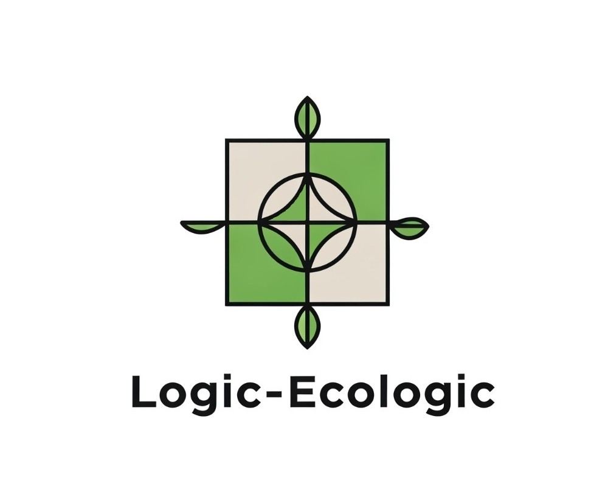

Miembros:
 * :bust_in_silhouette:  Rodrigo De Lorenzo Arenas     :octocat:     
 * :bust_in_silhouette:  Antonio Martínez Luque     :octocat:

# Proceso de Diseño 

 

## Paso 1. UX User & Desk Research & Analisis 

### 1.a User Reseach Plan
 
-----

Los mercados ecológicos en Granada como el EcoMercado de Granada y la asociación Valle y Vega, son dos iniciativas conocidas en el fomento del consumo sostenible y local. A través de estos espacios, los clientes adquieren productos orgánicos de manera directa, favoreciendo así a la economía local y produciendo un menor impacto ambiental, considerando el transporte y la producción rápida industrial.

El presente estudio abordará el ecosistema de los mencionados mercados, centrándose en los hábitos, las necesidades y las expectativas de sus integrantes-base: los clientes, los propietarios de los puestos y los organizadores. El estudio se enfocará en la motivación detrás de la elección de los usuarios, las barreras de acceso y las oportunidades de mejora.

La estrategia de investigación incluirá tanto métodos cualitativos como cuantitativos: Entrevistas con compradores y vendedores, observaciones en los mercados y encuestas para analizar patrones de consumo de los compradores. Además, se estudiará el impacto de la digitalización en la comercialización de productos ecológicos.

El objetivo final es encontrar puntos clave que permitan mejorar la experiencia de los usuarios y potenciar el crecimiento de estos mercados ecológicos en Granada.

### 1.b Competitive Analysis
 
-----
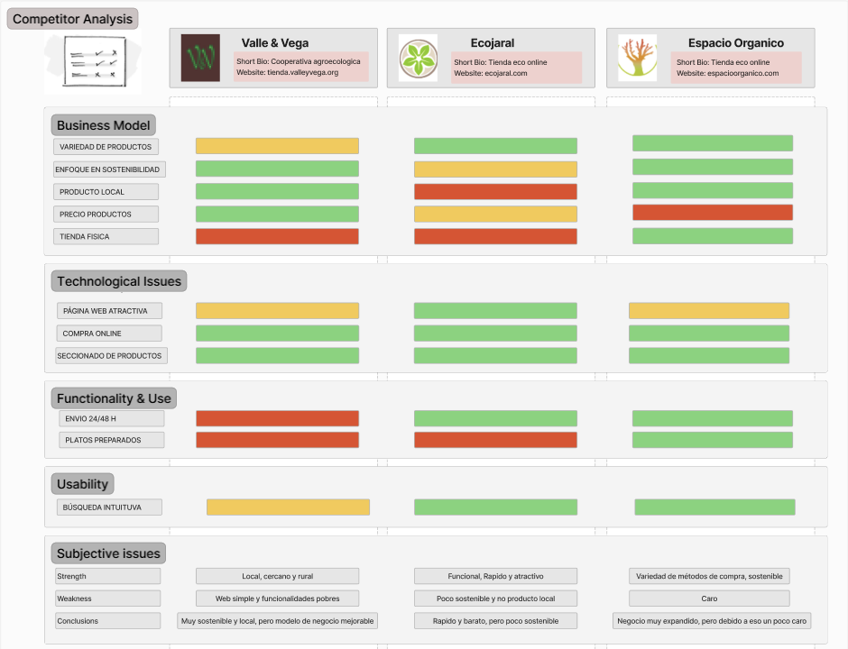 

>>> Nos hemos decantado por Espacio Organico, esto se debe a que nos ha parecido la pagina mas completa de las 3 que hemos evaludado, y la que nos puede ayudar mas a mejorar nuestra pagina y a hacerla mas completa y con el menor numero de fallos.

### 1.c Personas
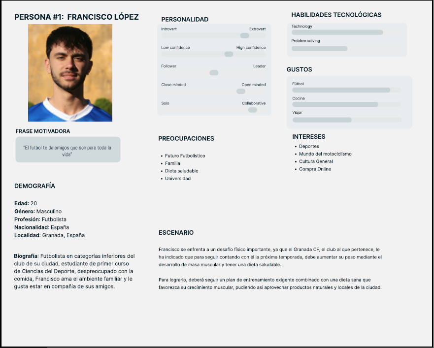
>>> Hemos elegido a Francisco para poner ejemplo de personas deportistas, ya sea futbol o cualquier otro deporte, ya que la gente profesional cuida mucho su dieta para seguir en la élite del deporte.

>>> A Pedro lo hemos elegido porque muestra como el conocimiento y consumo de los productos naturales tiene beneficios, y que son mucho mas sanos que los procesados.
-----

### 1.d User Journey Map
>>> Escenario:A Francisco le comunicaron que tenía que subir de peso y aumentar su masa muscular de calidad, por ello decide este tipo de compra online, pero su experiencia no fue buena en cuanto a usos y espectativas cumplidas.

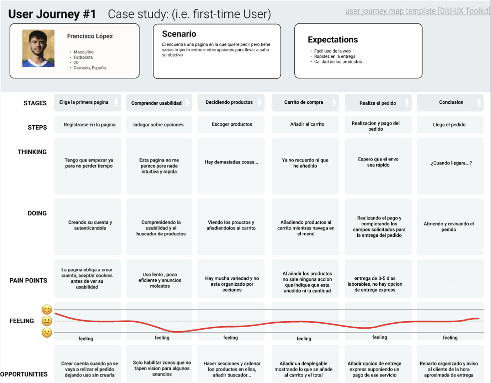 

>>> Escenario: Pedro vive en el campo, alejado de incluso otras fincas o casas, por eso nos ha parecido interesante cubrir este escenario de que no se encuentre la direccion o haya problemas con las entregas.

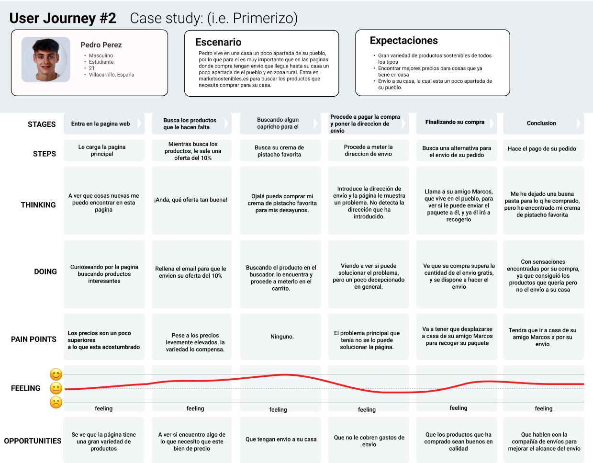 

### 1.e Usability Review
 
----

>>>  El objetivo es revisar la usabilidad del competidor seleccionado. Usamos un checklist de verificación:
>>> - Enlace al documento:   
>>> - URL y Valoración numérica obtenida:
>>>   - URL: espacioorganico.com
>>>   - Valoracion: 78 (Good)   
>>> - Comentario sobre la revisión:
>>>   - En los puntos fuertes hemos visto que la pagina tiene una gran variedad de productos y se ve muy atractica, pero flaquea sobretodo en la explicacion de errores y en el lenguaje que ultiliza, el cual a veces puede no ser el adecuado para gente que no esta acostumbrada a este tipo de paginas.

 

## Paso 2. UX Design  

### Ideación 
Debemos idear una propuesta de mercado online para impulsar la sostenibilidad y el producto local y ecologico en Granada. Para ello, se diseñará una supuesta aplicación de forma que se cubran las necesidades de los potenciales usuarios, Logic-Ecologic.

### 2.a Reframing / IDEACION: Feedback Capture Grid / EMpathy map 
 
----
* Malla receptora de información
  - Con nuestro 'Capture Grid' lo que buscamos es recopilar, organizar y sintetizar de manera estructurada las observaciones, ideas y comentarios de nuestro proyecto. Para esto hemos usado las opiniones de Pedro y Fransico en cuanto a que nos digan algunas cosas interesantes, algunas criticas y algunas preguntas que tengan. Finalmente hemos aportado nosotros algunos aspectos nuevos que hemos decidido incorporar en nuestra pagina.

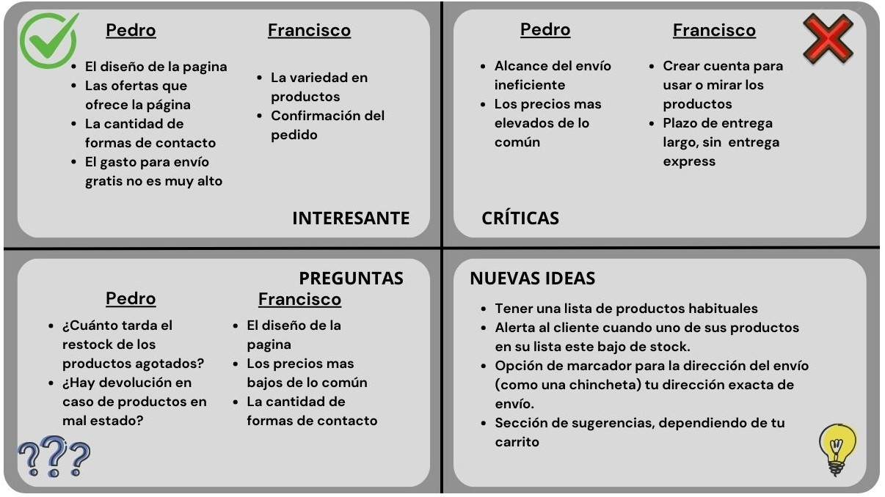

* Mapa de empatía
  - Para realizar el mapa de empatia nos hemos tenido que hacer 5 preguntas sobre nuestros clientes para entenderlos mejor y ponernos en su papel. Estas son ¿Que ven?, ¿Que dicen?, ¿Que hacen?, ¿Que oyen? y ¿Que piensan? Con esto buscamos ver de forma mas humana y cercana como podemos mejorar nuestra pagina para que sea mas atractiva a los clientes. Para ello usamos las ideas de nuestros clientes Pedro Perez y Francisco Lopez, asi como nuestras propias experiencias e ideas.
 
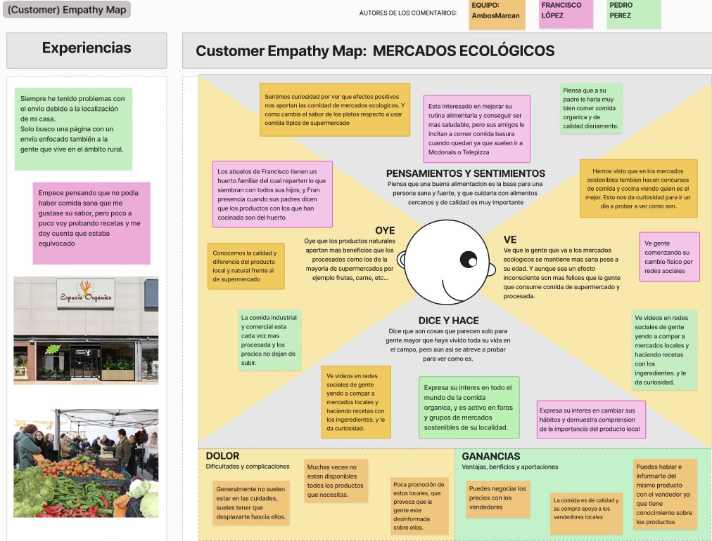

### PROPUESTA DE VALOR
Con **Logic-Ecologic** descubrirás una nueva forma de conectar con los mercados sostenibles y el producto local de Granada. Apoya a productores responsables, accede a alimentos frescos y de temporada, y contribuye activamente a un modelo de consumo más consciente, saludable y ecológico. Todo desde una plataforma digital pensada para quienes quieren marcar la diferencia en su forma de consumir.  
**Únete a Logic-Ecologic y forma parte del cambio hacia un futuro más sostenible.**

### 2.b ScopeCanvas

----
  - En los users needs, hemos reflejado los principales matices que los usuarios valoran a la hora de utilizar una aplicación. Además, éstos podrán realizar distintas acciones como dejar valoraciones, compartir su carrito y otras opciones similares.  
Mediremos el éxito de la aplicación mediante los informes ofrecidos por los proveedores de productos (por ejemplo: aumento de la venta de su comercio en base a nosotros), feedback de los usuarios, ingresos y numero de usuarios registrados.

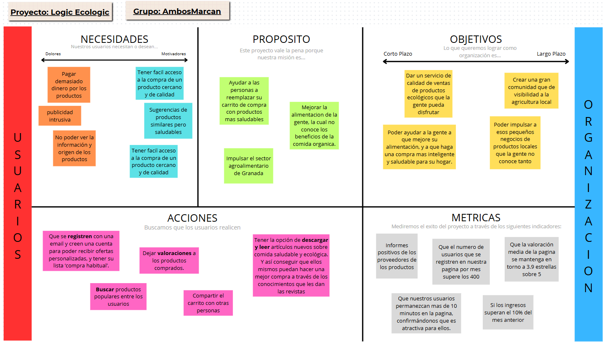

### 2.b User Flow (task) analysis 
 
-----
### TASK ANALYSIS

* User Task Matrix
  - Con la matriz de tareas lo que buscamos es plasmar y visualizar la relación entre las tareas que los usuarios necesitan realizar en nuestra pagina y las funcionalidades o características que posee nuestra pagina asi como la frecuencia de su uso en los usuarios dependiendo de su rol en el sistema. (Aqui debajo dejamos la leyenda de su uso)

  **VALORACION:**  
  0 -> Nunca/ muy poca frecuencia  
  1 -> Poca frecuencia  
  2 -> Frecuencia medio-alta  
  3 -> Mucha frecuencia  

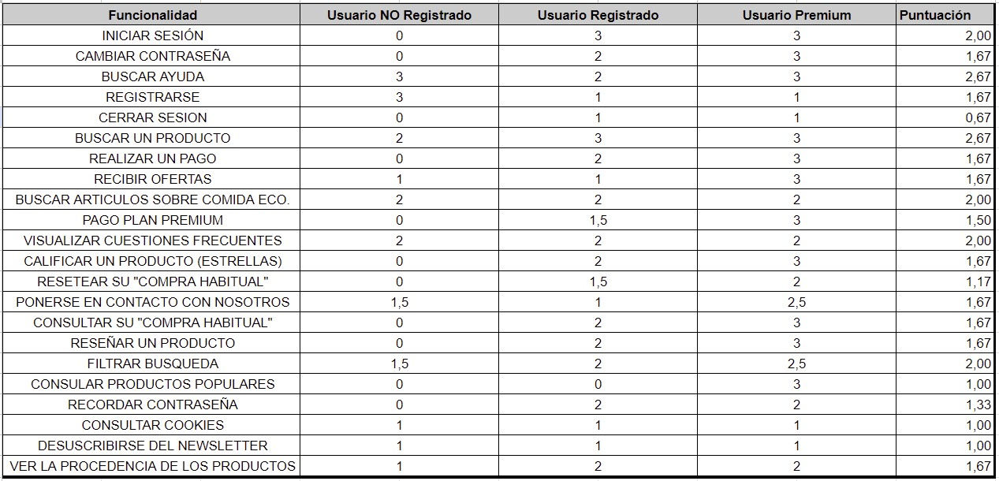

* User/Task flow
  - Hemos realizado el Task Flow de una de las funcionalidades clave de una pagina de venta de productos como es la nuestra.
  Esta funcionalidad es la de **realizar una compra**, donde hemos puesto todos los pasos que deberia realizar un cliente a la hora de hacer un pedido en nuestra pagina.

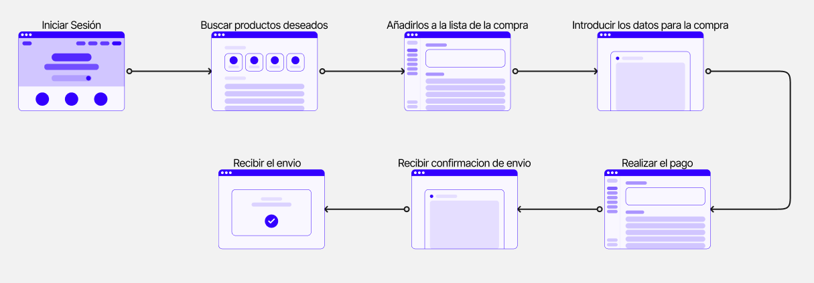

### 2.c IA: Sitemap + Labelling 
 
----
* Sitemap
  - Con el sitemap se puede ver de forma estrucurada como tenemos la organizadas las diferentes partes de nuestra pagina donde estan las 5 partes principales como lo son la Compra de productos, nuestros 'EcoArticulos', la Cuenta del usuario, la ayuda que pueda necesitar este y la informacion que brindamos sobre nosotros.
 
  
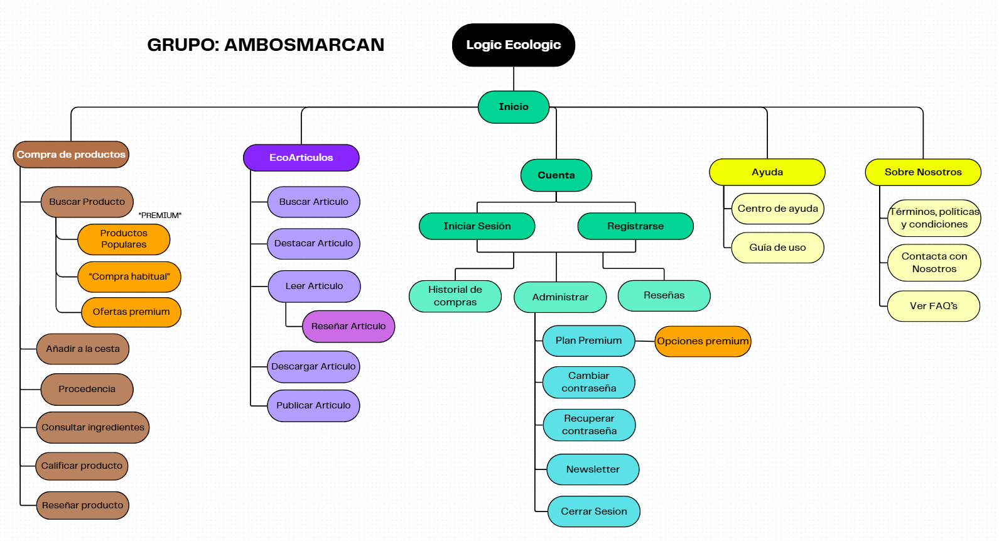
  
* Labelling

| Etiqueta                     | Descripción                                                                                                                       |
|-----------------------------|------------------------------------------------------------------------------------------------------------------------------------|
| Buscar producto             | Permite localizar productos disponibles desde el buscador principal.                                                               |
| Iniciar sesión              | Acceso para usuarios registrados o premium.                                                                                        |
| EcoArticulos                | Listado de contenidos informativos relacionados con comida ecológica.                                                              |
| Ver FAQs                    | Sección de ayuda con respuestas a preguntas frecuentes.                                                                            |
| Filtrar búsqueda            | Opción de aplicar filtros para afinar los resultados del buscador.                                                                 |
| Comprar                     | Realizar la compra de productos seleccionados.                                                                                     |
| Calificar producto          | Valorar un producto con estrellas.                                                                                                 |
| Reseñar producto            | Añadir una reseña textual sobre un producto adquirido.                                                                             |
| Contacta con Nosotros       | Formulario o medios para contactar con el equipo de Logic Ecologic.                                                                |
| Compra habitual             | Consulta de productos que el usuario suele comprar recurrentemente.                                                                |
| Procedencia                 | Información sobre el origen del producto (productor, ingredientes, etc.).                                                          |
| Plan premium                | Página para contratar el plan premium con sus ventajas.                                                                            |
| Ofertas Premium             | Acceso a promociones y descuentos exclusivos.                                                                                      |
| Ayuda                       | Acceso al centro de ayuda o guía de uso.                                                                                           |
| Recuperar contraseña        | Función para restaurar acceso en caso de olvido de contraseña.                                                                     |
| Reiniciar compra habitual   | Permite vaciar y configurar de nuevo su selección de productos frecuentes.                                                         |
| Registrarse                 | Creación de cuenta nueva en la plataforma.                                                                                         |
| Productos populares         | Consulta de productos destacados o más valorados.                                                                                  |
| Cookies                     | Información y configuración de cookies.                                                                                            |
| Newsletter                  | Gestionar la suscripción a comunicaciones por correo.                                                                              |
| Cambiar contraseña          | Modificar la clave de acceso desde el perfil de usuario.                                                                           |
| Cerrar sesión               | Finaliza la sesión del usuario activo.                                                                                             |

### 2.d Wireframes
 
-----
  - Hemos usado NoteWise para hacer el boceto ya que es una aplicacion que nos da mucha libertad de dibujo y expresion y nos ha parecido lo mas conveniente.

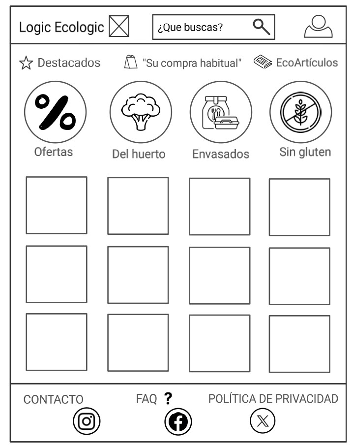

 

## Paso 3. Mi UX-Case Study (diseño)

# UX Case Study – Logic Ecologic 🌱

**Autor:** AmbosMarcan  
**Práctica 3:** Diseño visual y prototipado  
**Fecha de entrega:** [18/05/2025]  

Este documento recoge todo el trabajo realizado en la Práctica 3 del curso de DIU. A través de distintas fases —moodboard, landing page, patrones UI y prototipado— se ha desarrollado una propuesta visual completa para **Logic Ecologic**, una plataforma centrada en conectar consumidores con mercados locales sostenibles.

---

## 3.a Moodboard

El **moodboard** representa la atmósfera visual del producto. A través de imágenes, colores, tipografías y elementos gráficos, definimos la identidad estética de la plataforma y guiamos las decisiones de diseño.

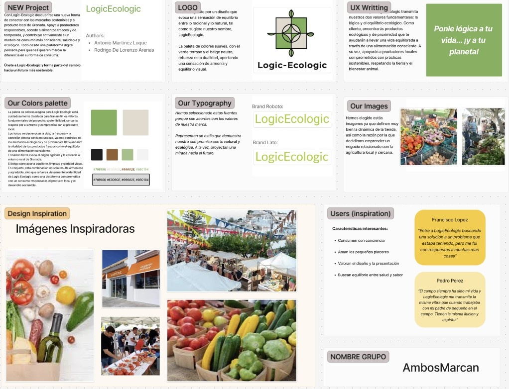

---

## 3.b Landing Page

La **landing page** es el primer contacto del usuario con Logic Ecologic. Está diseñada para captar su atención, transmitir el valor de la plataforma y fomentar la interacción. Hemos empleado elementos visuales definidos en el moodboard para mantener coherencia visual.

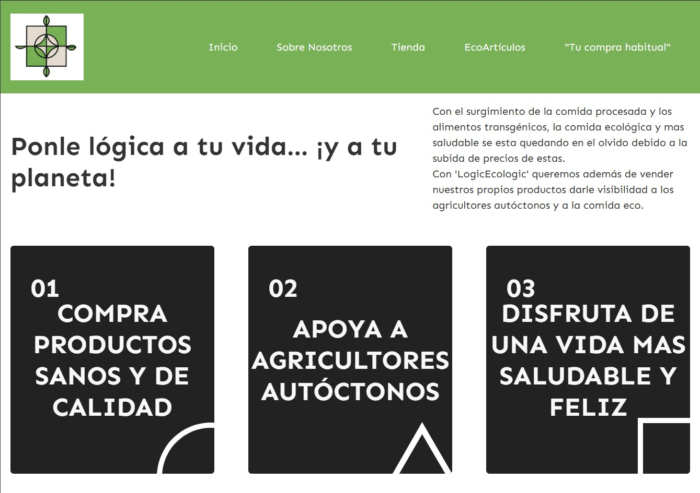

🔗 [Visita la landing page](http://logicecologic-824774.webflow.io/)  
🌐 Herramienta utilizada: [Webflow](https://www.webflow.io)

---

## 3.c Guidelines

Estos son los patrones de diseño y componentes UI seleccionados para construir la experiencia de usuario:

- **Onboarding:** Página de bienvenida para introducir al usuario en la plataforma.
- **Menú móvil:** Navegación optimizada para dispositivos móviles.
- **Carrusel de productos:** Visualización dinámica de productos destacados, recomendados o en oferta.
- **Search:** Barra de búsqueda funcional y accesible.
- **Card Items:** Tarjetas para representar productos de forma clara y compacta.
- **Item Details:** Información detallada del producto (ingredientes, alérgenos, nutrición).
- **Reserva:** Añadir productos al carrito para su posterior compra.
- **Form Input (Slider):** Selección de distancia en kilómetros para personalizar el origen de los productos.
- **About:** Sección informativa sobre el propósito y visión del proyecto.

---

## 3.d Mockup Hi-Fi

El Mockup refleja cómo se verán y funcionarán las pantallas principales de Logic Ecologic, integrando todos los elementos visuales definidos.

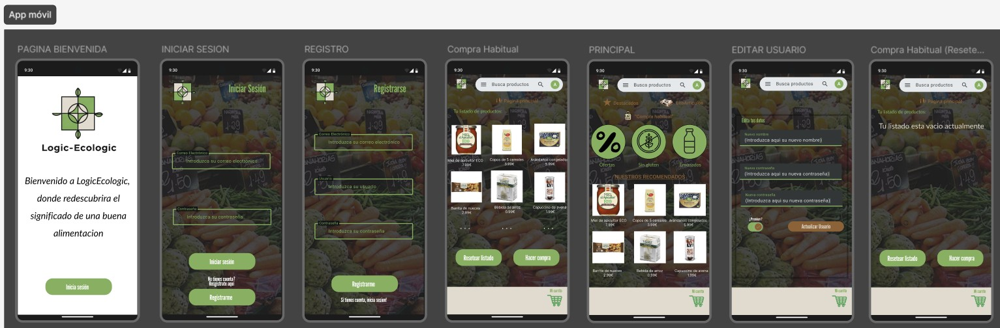

🔗 [Mockup en Figma (Hi-Fi)](https://www.figma.com/design/LIJcYPqpDTh2SzlqtOg3wd/Layout-Hi-Fi--Copy-?node-id=0-1&p=f&t=imJqoZQwvP186xRv-0)

---

## 3.e Conclusión: ¿My UX Case Study?

Este documento ha sido preparado para su publicación en GitHub como entrega final de la práctica. Resume de forma estructurada el trabajo de diseño realizado, incluyendo la documentación visual, los patrones UI utilizados y un prototipo navegable. Se ha aplicado una metodología centrada en el usuario para diseñar una plataforma coherente, funcional y atractiva.

 

## Paso 4. Pruebas de Evaluación 

### 4.a Reclutamiento de usuarios 

-----
Nuestra misión era evaluar la usabilidad de la plataforma [La Tela De Vida](https://github.com/DIU3-LEVELING/UX_CaseStudy), que se enfoca en promover la moda circular, ofreciendo una plataforma confiable donde las personas puedan comprar ropa usada de calidad y tener la opcion de darle un toque personal en talleres.

Uno de los desafíos que enfrentamos fue entender cómo los diferentes usuarios interactúan con las distintas funcionalidades de la plataforma. Desde la navegación por las diferentes prendas,  la participación en talleres, necesitábamos una visión clara de la experiencia del usuario.

Para abordar esto, seleccionamos un grupo diverso de usuarios que realizarían tareas específicas en la plataforma, y luego evaluaríamos su experiencia utilizando métodos de testing de usabilidad y el cuestionario SUS.

| Usuarios | Sexo/Edad     | Ocupación   |  Exp.TIC    | Personalidad | Plataforma | Caso
| ---------| ------------- | ----------- | ----------- | -----------  | ---------- | ----
| Eduardo  | H / 72        | Jubilado    | Baja/Media  | Extrovertido | Móvil      | A 
| Felipe   | H / 26        | Informatico | Alta        | Introvertido | Linux      | A 
| Julian   | H / 21        | Estudiante  | Alta        | Timido       | Windows    | B 
| Manuela  | M / 42      | Directora financiera  | Media | Emocional | Móvil     | B

**Historia de los Usuarios**

Eduardo, un jubilado de 72 años, con poca experiencia en tecnología, utiliza su movil para explorar la plataforma. Persona extrovertida, que se interesa por los articulos ofrecidos y los valora como una oportunidad para aprender.

Felipe, informático de 37 años, es introvertido y tiene un conocimiento alto en tecnología. Accede desde su portatil con Linux a la plataforma, disfrutando de la facilidad de comprar desde casa y leer EcoArticulos para inspirarse a llenar el carrito.

Julian, un estudiante tímido de 21 años con alta experiencia en tecnología, utiliza Windows para acceder a la plataforma. Aunque reservado, valora la estructura clara y la facilidad de acceso a información sobre los productos.

Manuela, directora financiera racional de 42 años, utiliza su móvil para acceder a la plataforma. Aprecia la organización lógica , la claridad en la presentación y precios a la vista.

### 4.b Diseño de las pruebas 
 
-----

>>> Planifique qué pruebas se van a desarrollar. ¿En qué consisten? ¿Se hará uso del checklist de la P1?

### 4.c Cuestionario SUS
 
----
Para realizar un análisis de ambas aplicaciones, usaremos un cuestionario SUS. Para ello veremos la calificacion de las personas ficticias que hemos descrito anteriormente.

Los resultados obtenidos se encuentran en [el siguiente fichero](P4/Cuestionario_SUS_DIU.xlsx).

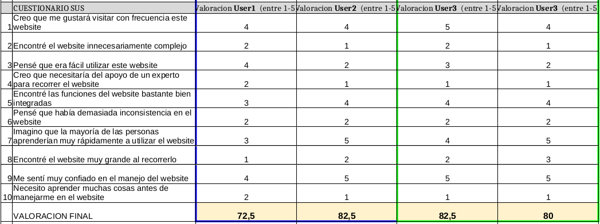

Podemos ver que ambas paginas han obtenido buenos resultados en el cuestionario SUS. Siendo Tela de Vida un poco superior en resultados.

Los resultados han quedado de la siguiente forma:    
- LogicEcologic: Eduardo -> 72.5 puntos | Felipe -> 82.5
   - Total normalizado: 77.5
- Tela de Vida: Manuela -> 82.5 | Julián -> 80
   - Total normalizado: 81.25

### 4.d A/B Testing
 
-----

>>> Los resultados de un A/B testing con 3 pruebas y 2 casos o alternativas daría como resultado una tabla de 3 filas y 2 columnas, además de un resultado agregado global. Especifique con claridad el resultado: qué caso es más usable, A o B?

### 4.e Aplicación del método Eye Tracking 

----
Este estudio de Eyetracking lo hemos llevado a cabo para analizar el comportamiento visual de los usuarios mientras realizan dos tareas diferentes en dos plataformas distintas.
Los usuarios escogidos son Carmen y Jaime.
- Carmen hará la tarea A.
- Jaime hará la tarea B.

Para realizar el eyetracking hemos usado un plugin de Figma (NB Heatmap).

Las tareas que deberan realizar los usuarios escogidos seran las siguientes:
1. Tarea A: Realizar un pago completo

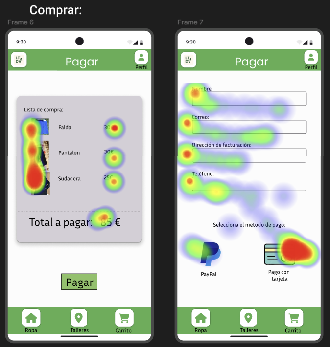
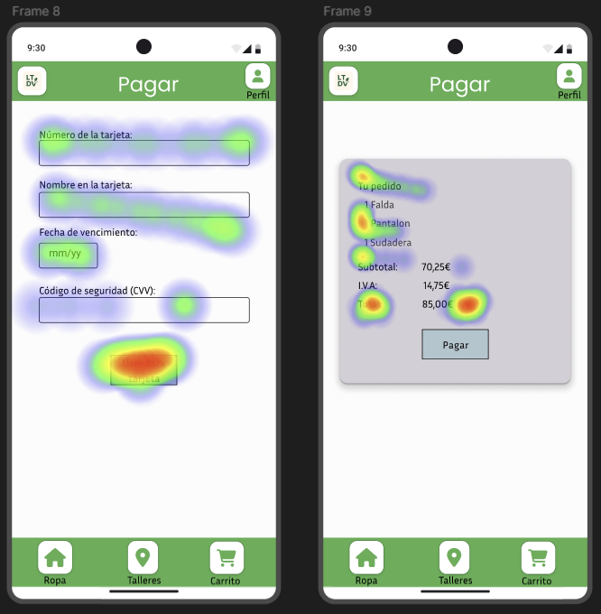

2. Tarea B: Consultar uno de los articulos que hay publicados en la seccion de Ropa.
- En esta tarea comentar la necesidad de incluir una parte exclisivamente dedicada a la talla para que se vea rapidamente y obligatoriamente.

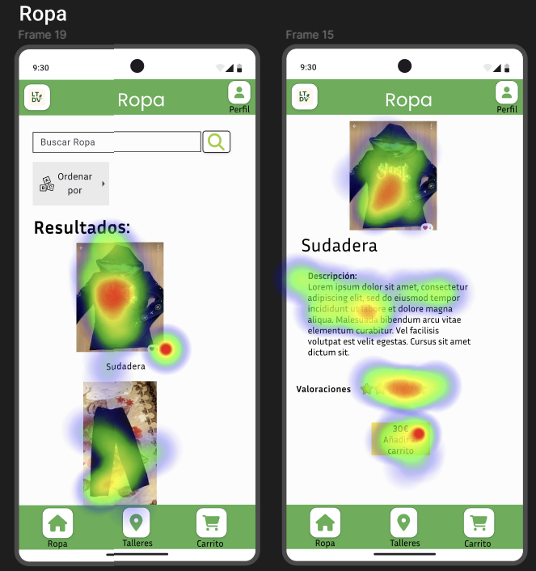

Los objetivos de este estudio son:
* Identificar áreas de interés (AOI) en las interfaces de usuario.
* Analizar patrones de fijación y movimientos oculares.
* Evaluar la usabilidad de las plataformas en función del comportamiento visual de los usuarios.

### 4.f Usability Report de B
 
-----
**Valoración General:**

La Tela De Vida es una plataforma visualmente atractiva y funcional, pero identificamos áreas clave para mejorar la experiencia del usuario.

**Debilidades de Usabilidad y Recomendaciones:**

Falta de confirmación visual (Visibilidad del Estado del Sistema):

Problema: Al añadir artículos o registrarse, no siempre hay una confirmación clara de que la acción se ha realizado.
Recomendación: Implementar notificaciones visuales (pop-ups, cambios de iconos) para confirmar cada acción del usuario.
Dificultad para retroceder (Control y Libertad del Usuario):

Problema: En procesos largos (inscripción a talleres, subida de prendas), los botones para volver atrás o cancelar no siempre son fáciles de encontrar.
Recomendación: Asegurar que los botones de "volver" o "cancelar" sean siempre visibles y accesibles en cada paso de un proceso.
Inconsistencia en el diseño (Consistencia y Estándares):

Problema: Pequeñas variaciones en tipografías y estilos de botones en diferentes secciones de la plataforma.
Recomendación: Estandarizar el diseño de todos los elementos (textos, botones) para una apariencia más pulcra y coherente.
Información de producto poco destacada (Reconocimiento antes que Recuerdo):

Problema: Tallas o el estado de la prenda no siempre son visibles en el listado, obligando al usuario a buscar en la descripción.
Recomendación: Destacar visualmente la información clave (talla, estado, precio) directamente en los listados de productos.
Ayuda limitada (Ayuda y Documentación):

Problema: La sección de Preguntas Frecuentes (FAQ) no cubre todas las dudas sobre la calidad de las prendas o el funcionamiento detallado de los talleres.
Recomendación: Ampliar la sección de FAQ con respuestas más detalladas y considerar tutoriales cortos para los procesos clave.
Valoración Personal del Equipo LogicEcologic:

Esta evaluación ha sido fundamental para nosotros, LogicEcologic. Nos permitió aplicar nuestros conocimientos de UX en un caso práctico, identificando oportunidades de mejora en la plataforma de nuestros compañeros. Fue una experiencia enriquecedora que profundizó nuestra comprensión de la usabilidad y la importancia de la evaluación constante.

 

## Paso 5. Exportación y Documentación 

### 5.a Exportación a HTML/React
 
----

>>> Breve descripción de esta tarea. Las evidencias de este paso quedan subidas a P5/

### 5.b Documentación con Storybook

----

>>> Breve descripción de esta tarea. Las evidencias de este paso quedan subidas a P5/

 

## Conclusiones finales & Valoración de las prácticas

>>> Opinión FINAL del proceso de desarrollo de diseño siguiendo metodología UX y valoración (positiva /negativa) de los resultados obtenidos. ¿Qué se puede mejorar? Recuerda que este tipo de texto se debe eliminar del template que se os proporciona 

