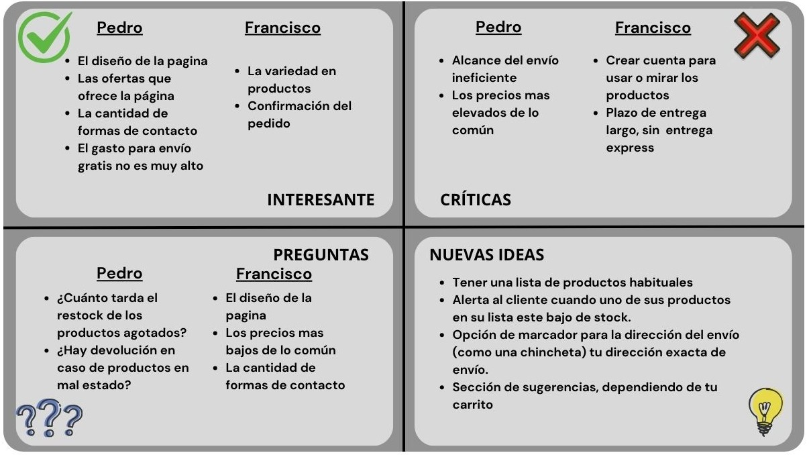
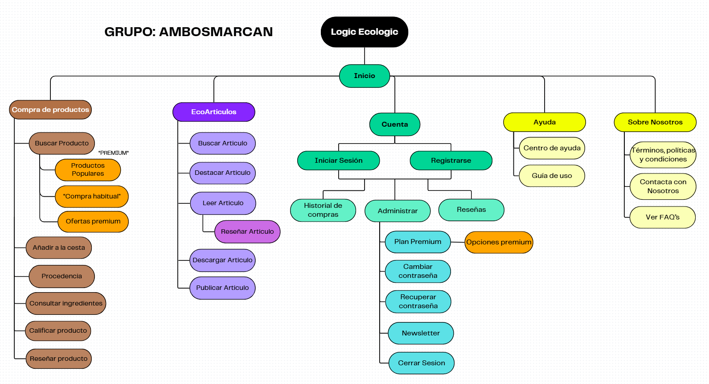
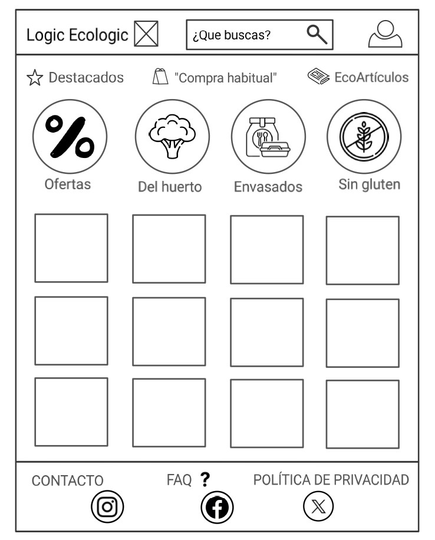
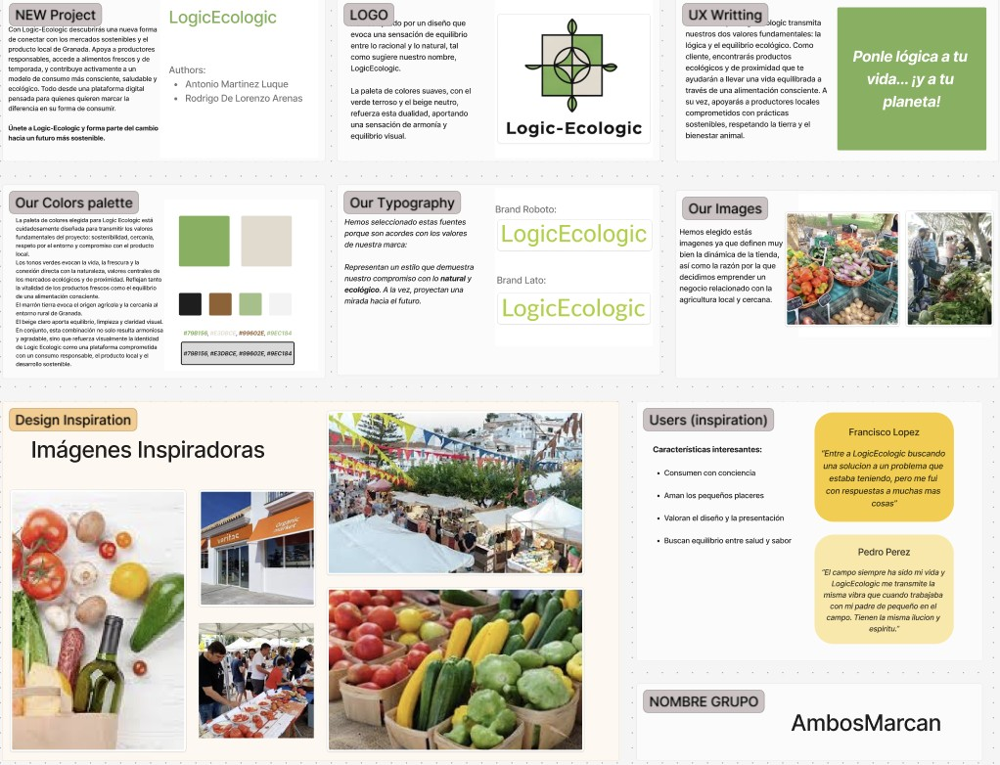
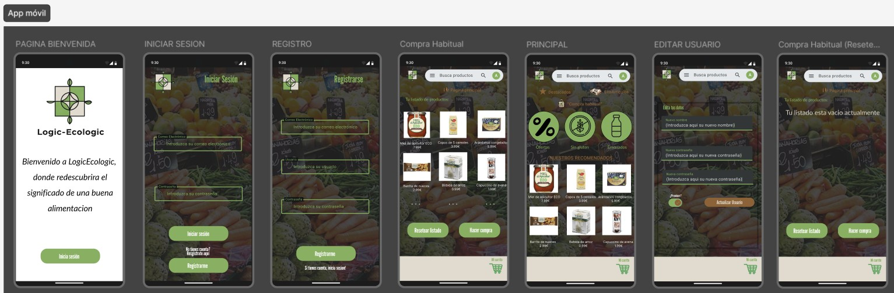

# DIU25
Prácticas Diseño Interfaces de Usuario (Tema: Mercados Sostenibles ) 

[Guiones de pr√°cticas](GuionesPracticas/)

Grupo: DIU1_AmbosMarcan.  Curso: 2024/25 

Actualizado: 31/05/2025

Proyecto: Logic Ecologic

Descripción: 

Nuestro proyecto Logic-Ecologic es una plataforma web basada en los mercados sostenibles, en la cual se pueden las acciones basicas de un supermercado (realizar pedidos, ver detalles de los productos,...) y ademas tiene funcionalidades que nos hacen resaltar sobre el resto como una seccion de Compra Habitual (basada en las compras del cliente), nuestra sección de EcoArticulos, productos populares, avisos de stock, y más aun por descubrir, **únete a Logic-Ecologic y forma parte del cambio hacia un futuro más sostenible**.

Logotipo: 

Miembros:
 * :bust_in_silhouette:  Rodrigo De Lorenzo Arenas     :octocat:     
 * :bust_in_silhouette:  Antonio Martínez Luque     :octocat:

# Proceso de Diseño 

 

## Paso 1. UX User & Desk Research & Analisis 

### 1.a User Reseach Plan
 
-----

Los mercados ecológicos en Granada como el EcoMercado de Granada y la asociación Valle y Vega, son dos iniciativas conocidas en el fomento del consumo sostenible y local. A través de estos espacios, los clientes adquieren productos orgánicos de manera directa, favoreciendo así a la economía local y produciendo un menor impacto ambiental, considerando el transporte y la producción rápida industrial.

El presente estudio abordará el ecosistema de los mencionados mercados, centrándose en los hábitos, las necesidades y las expectativas de sus integrantes-base: los clientes, los propietarios de los puestos y los organizadores. El estudio se enfocará en la motivación detrás de la elección de los usuarios, las barreras de acceso y las oportunidades de mejora.

La estrategia de investigación incluirá tanto métodos cualitativos como cuantitativos: Entrevistas con compradores y vendedores, observaciones en los mercados y encuestas para analizar patrones de consumo de los compradores. Además, se estudiará el impacto de la digitalización en la comercialización de productos ecológicos.

El objetivo final es encontrar puntos clave que permitan mejorar la experiencia de los usuarios y potenciar el crecimiento de estos mercados ecológicos en Granada.

### 1.b Competitive Analysis
 
-----
 

>>> Nos hemos decantado por Espacio Organico, esto se debe a que nos ha parecido la pagina mas completa de las 3 que hemos evaludado, y la que nos puede ayudar mas a mejorar nuestra pagina y a hacerla mas completa y con el menor numero de fallos.

### 1.c Personas

>>> Hemos elegido a Francisco para poner ejemplo de personas deportistas, ya sea futbol o cualquier otro deporte, ya que la gente profesional cuida mucho su dieta para seguir en la élite del deporte.

>>> A Pedro lo hemos elegido porque muestra como el conocimiento y consumo de los productos naturales tiene beneficios, y que son mucho mas sanos que los procesados.
-----

### 1.d User Journey Map
>>> Escenario:A Francisco le comunicaron que tenía que subir de peso y aumentar su masa muscular de calidad, por ello decide este tipo de compra online, pero su experiencia no fue buena en cuanto a usos y espectativas cumplidas.

 

>>> Escenario: Pedro vive en el campo, alejado de incluso otras fincas o casas, por eso nos ha parecido interesante cubrir este escenario de que no se encuentre la direccion o haya problemas con las entregas.

 

### 1.e Usability Review
 
----

>>>  El objetivo es revisar la usabilidad del competidor seleccionado. Usamos un checklist de verificación. Tras usarlo, subelo a la carpeta P1/ Ofrece aquí un parrafo para:
>>> - Enlace al documento:   
>>> - URL y Valoración numérica obtenida:
>>>   - URL: espacioorganico.com
>>>   - Valoracion: 78 (Good)   
>>> - Comentario sobre la revisión:
>>>   - En los puntos fuertes hemos visto que la pagina tiene una gran variedad de productos y se ve muy atractica, pero flaquea sobretodo en la explicacion de errores y en el lenguaje que ultiliza, el cual a veces puede no ser el adecuado para gente que no esta acostumbrada a este tipo de paginas.

 

## Paso 2. UX Design  

### Ideación 
Debemos idear una propuesta de mercado online para impulsar la sostenibilidad y el producto local y ecologico en Granada. Para ello, se diseñará una supuesta aplicación de forma que se cubran las necesidades de los potenciales usuarios, Logic-Ecologic.

### 2.a Reframing / IDEACION: Feedback Capture Grid / EMpathy map 
 
----
* Malla receptora de información
  - Con nuestro 'Capture Grid' lo que buscamos es recopilar, organizar y sintetizar de manera estructurada las observaciones, ideas y comentarios de nuestro proyecto. Para esto hemos usado las opiniones de Pedro y Fransico en cuanto a que nos digan algunas cosas interesantes, algunas criticas y algunas preguntas que tengan. Finalmente hemos aportado nosotros algunos aspectos nuevos que hemos decidido incorporar en nuestra pagina.

* Mapa de empatía
  - Para realizar el mapa de empatia nos hemos tenido que hacer 5 preguntas sobre nuestros clientes para entenderlos mejor y ponernos en su papel. Estas son ¬øQue ven?, ¬øQue dicen?, ¬øQue hacen?, ¬øQue oyen? y ¬øQue piensan? Con esto buscamos ver de forma mas humana y cercana como podemos mejorar nuestra pagina para que sea mas atractiva a los clientes. Para ello usamos las ideas de nuestros clientes Pedro Perez y Francisco Lopez, asi como nuestras propias experiencias e ideas.
 

### PROPUESTA DE VALOR
Con **Logic-Ecologic** descubrirás una nueva forma de conectar con los mercados sostenibles y el producto local de Granada. Apoya a productores responsables, accede a alimentos frescos y de temporada, y contribuye activamente a un modelo de consumo más consciente, saludable y ecológico. Todo desde una plataforma digital pensada para quienes quieren marcar la diferencia en su forma de consumir.  
**√önete a Logic-Ecologic y forma parte del cambio hacia un futuro m√°s sostenible.**

### 2.b ScopeCanvas

----
  - En los users needs, hemos reflejado los principales matices que los usuarios valoran a la hora de utilizar una aplicación. Además, éstos podrán realizar distintas acciones como dejar valoraciones, compartir su carrito y otras opciones similares.  
Mediremos el éxito de la aplicación mediante los informes ofrecidos por los proveedores de productos (por ejemplo: aumento de la venta de su comercio en base a nosotros), feedback de los usuarios, ingresos y numero de usuarios registrados.

### 2.b User Flow (task) analysis 
 
-----
### TASK ANALYSIS

* User Task Matrix
  - Con la matriz de tareas lo que buscamos es plasmar y visualizar la relación entre las tareas que los usuarios necesitan realizar en nuestra pagina y las funcionalidades o características que posee nuestra pagina asi como la frecuencia de su uso en los usuarios dependiendo de su rol en el sistema. (Aqui debajo dejamos la leyenda de su uso)

  **VALORACION:**  
  0 -> Nunca/ muy poca frecuencia  
  1 -> Poca frecuencia  
  2 -> Frecuencia medio-alta  
  3 -> Mucha frecuencia  

* User/Task flow
  - Hemos realizado el Task Flow de una de las funcionalidades clave de una pagina de venta de productos como es la nuestra.
  Esta funcionalidad es la de **realizar una compra**, donde hemos puesto todos los pasos que deberia realizar un cliente a la hora de hacer un pedido en nuestra pagina.

### 2.c IA: Sitemap + Labelling 
 
----
* Sitemap
  - Con el sitemap se puede ver de forma estrucurada como tenemos la organizadas las diferentes partes de nuestra pagina donde estan las 5 partes principales como lo son la Compra de productos, nuestros 'EcoArticulos', la Cuenta del usuario, la ayuda que pueda necesitar este y la informacion que brindamos sobre nosotros.
 
  

  
* Labelling

| Etiqueta                     | Descripción                                                                                                                       |
|-----------------------------|------------------------------------------------------------------------------------------------------------------------------------|
| Buscar producto             | Permite localizar productos disponibles desde el buscador principal.                                                               |
| Iniciar sesión              | Acceso para usuarios registrados o premium.                                                                                        |
| EcoArticulos                | Listado de contenidos informativos relacionados con comida ecológica.                                                              |
| Ver FAQs                    | Sección de ayuda con respuestas a preguntas frecuentes.                                                                            |
| Filtrar búsqueda            | Opción de aplicar filtros para afinar los resultados del buscador.                                                                 |
| Comprar                     | Realizar la compra de productos seleccionados.                                                                                     |
| Calificar producto          | Valorar un producto con estrellas.                                                                                                 |
| Reseñar producto            | Añadir una reseña textual sobre un producto adquirido.                                                                             |
| Contacta con Nosotros       | Formulario o medios para contactar con el equipo de Logic Ecologic.                                                                |
| Compra habitual             | Consulta de productos que el usuario suele comprar recurrentemente.                                                                |
| Procedencia                 | Información sobre el origen del producto (productor, ingredientes, etc.).                                                          |
| Plan premium                | P√°gina para contratar el plan premium con sus ventajas.                                                                            |
| Ofertas Premium             | Acceso a promociones y descuentos exclusivos.                                                                                      |
| Ayuda                       | Acceso al centro de ayuda o guía de uso.                                                                                           |
| Recuperar contraseña        | Función para restaurar acceso en caso de olvido de contraseña.                                                                     |
| Reiniciar compra habitual   | Permite vaciar y configurar de nuevo su selección de productos frecuentes.                                                         |
| Registrarse                 | Creación de cuenta nueva en la plataforma.                                                                                         |
| Productos populares         | Consulta de productos destacados o m√°s valorados.                                                                                  |
| Cookies                     | Información y configuración de cookies.                                                                                            |
| Newsletter                  | Gestionar la suscripción a comunicaciones por correo.                                                                              |
| Cambiar contraseña          | Modificar la clave de acceso desde el perfil de usuario.                                                                           |
| Cerrar sesión               | Finaliza la sesión del usuario activo.                                                                                             |

### 2.d Wireframes
 
-----
  - Hemos usado NoteWise para hacer el boceto ya que es una aplicacion que nos da mucha libertad de dibujo y expresion y nos ha parecido lo mas conveniente.

 

## Paso 3. Mi UX-Case Study (diseño)

# UX Case Study – Logic Ecologic 🌱

**Autor:** AmbosMarcan  
**Práctica 3:** Diseño visual y prototipado  
**Fecha de entrega:** [18/05/2025]  

Este documento recoge todo el trabajo realizado en la Práctica 3 del curso de DIU. A través de distintas fases —moodboard, landing page, patrones UI y prototipado— se ha desarrollado una propuesta visual completa para **Logic Ecologic**, una plataforma centrada en conectar consumidores con mercados locales sostenibles.

---

## 3.a Moodboard

El **moodboard** representa la atmósfera visual del producto. A través de imágenes, colores, tipografías y elementos gráficos, definimos la identidad estética de la plataforma y guiamos las decisiones de diseño.

---

## 3.b Landing Page

La **landing page** es el primer contacto del usuario con Logic Ecologic. Está diseñada para captar su atención, transmitir el valor de la plataforma y fomentar la interacción. Hemos empleado elementos visuales definidos en el moodboard para mantener coherencia visual.

üîó [Visita la landing page](http://logicecologic-824774.webflow.io/)  
üåê Herramienta utilizada: [Webflow](https://www.webflow.io)

---

## 3.c Guidelines

Estos son los patrones de diseño y componentes UI seleccionados para construir la experiencia de usuario:

- **Onboarding:** P√°gina de bienvenida para introducir al usuario en la plataforma.
- **Menú móvil:** Navegación optimizada para dispositivos móviles.
- **Carrusel de productos:** Visualización dinámica de productos destacados, recomendados o en oferta.
- **Search:** Barra de b√∫squeda funcional y accesible.
- **Card Items:** Tarjetas para representar productos de forma clara y compacta.
- **Item Details:** Información detallada del producto (ingredientes, alérgenos, nutrición).
- **Reserva:** Añadir productos al carrito para su posterior compra.
- **Form Input (Slider):** Selección de distancia en kilómetros para personalizar el origen de los productos.
- **About:** Sección informativa sobre el propósito y visión del proyecto.

---

## 3.d Mockup Hi-Fi

El Mockup refleja cómo se verán y funcionarán las pantallas principales de Logic Ecologic, integrando todos los elementos visuales definidos.

üîó [Mockup en Figma (Hi-Fi)](https://www.figma.com/design/LIJcYPqpDTh2SzlqtOg3wd/Layout-Hi-Fi--Copy-?node-id=0-1&p=f&t=imJqoZQwvP186xRv-0)

---

## 3.e Conclusión: ¿My UX Case Study?

Este documento ha sido preparado para su publicación en GitHub como entrega final de la práctica. Resume de forma estructurada el trabajo de diseño realizado, incluyendo la documentación visual, los patrones UI utilizados y un prototipo navegable. Se ha aplicado una metodología centrada en el usuario para diseñar una plataforma coherente, funcional y atractiva.

 

## Paso 4. Pruebas de Evaluación 

### 4.a Reclutamiento de usuarios 

-----

>>> Breve descripción del caso asignado (llamado Caso-B) con enlace al repositorio Github
>>> Tabla y asignación de personas ficticias (o reales) a las pruebas. Exprese las ideas de posibles situaciones conflictivas de esa persona en las propuestas evaluadas. Mínimo 4 usuarios: asigne 2 al Caso A y 2 al caso B.

| Usuarios | Sexo/Edad     | Ocupación   |  Exp.TIC    | Personalidad | Plataforma | Caso
| ------------- | -------- | ----------- | ----------- | -----------  | ---------- | ----
| User1's name  | H / 18   | Estudiante  | Media       | Introvertido | Web.       | A 
| User2's name  | H / 18   | Estudiante  | Media       | Timido       | Web        | A 
| User3's name  | M / 35   | Abogado     | Baja        | Emocional    | móvil      | B 
| User4's name  | H / 18   | Estudiante  | Media       | Racional     | Web        | B 

### 4.b Diseño de las pruebas 
 
-----

>>> Planifique qué pruebas se van a desarrollar. ¿En qué consisten? ¿Se hará uso del checklist de la P1?

### 4.c Cuestionario SUS
 
----

>>> Como uno de los test para la prueba A/B testing, usaremos el **Cuestionario SUS** que permite valorar la satisfacción de cada usuario con el diseño utilizado (casos A o B). Para calcular la valoración numérica y la etiqueta linguistica resultante usamos la [hoja de cálculo](https://github.com/mgea/DIU19/blob/master/Cuestionario%20SUS%20DIU.xlsx). Previamente conozca en qué consiste la escala SUS y cómo se interpretan sus resultados
http://usabilitygeek.com/how-to-use-the-system-usability-scale-sus-to-evaluate-the-usability-of-your-website/)
Para más información, consultar aquí sobre la [metodología SUS](https://cui.unige.ch/isi/icle-wiki/_media/ipm:test-suschapt.pdf)
>>> Adjuntar en la carpeta P4/ el excel resultante y describa aquí la valoración personal de los resultados 

### 4.d A/B Testing
 
-----

>>> Los resultados de un A/B testing con 3 pruebas y 2 casos o alternativas daría como resultado una tabla de 3 filas y 2 columnas, además de un resultado agregado global. Especifique con claridad el resultado: qué caso es más usable, A o B?

### 4.e Aplicación del método Eye Tracking 

----

>>> Indica cómo se diseña el experimento y se reclutan los usuarios. Explica la herramienta / uso de gazerecorder.com u otra similar. Aplíquese únicamente al caso B.

  
>>> Cambiar esta img por una de vuestro experimento. El recurso deber√° estar subido a la carpeta P4/  

>>> gazerecorder en versión de pruebas puede estar limitada a 3 usuarios para generar mapa de calor (crédito > 0 para que funcione) 

### 4.f Usability Report de B
 
-----

>>> Añadir report de usabilidad para práctica B (la de los compañeros) aportando resultados y valoración de cada debilidad de usabilidad. 
>>> Enlazar aqui con el archivo subido a P4/ que indica qué equipo evalua a qué otro equipo.

>>> Complementad el Case Study en su Paso 4 con una Valoración personal del equipo sobre esta tarea

 

## Paso 5. Exportación y Documentación 

### 5.a Exportación a HTML/React
 
----

>>> Breve descripción de esta tarea. Las evidencias de este paso quedan subidas a P5/

### 5.b Documentación con Storybook

----

>>> Breve descripción de esta tarea. Las evidencias de este paso quedan subidas a P5/

 

## Conclusiones finales & Valoración de las prácticas

>>> Opinión FINAL del proceso de desarrollo de diseño siguiendo metodología UX y valoración (positiva /negativa) de los resultados obtenidos. ¿Qué se puede mejorar? Recuerda que este tipo de texto se debe eliminar del template que se os proporciona 

